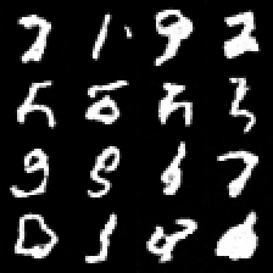

# A tiny diffusion model, sampled by CUDA kernels on an Apple GPU



*16 samples, drawn from pure noise in 1000 DDPM steps. Every kernel launch went
through CuMetal to a Metal command buffer. Not every sample is a clean digit —
that is 12 epochs of a 312k-parameter model, not a CuMetal artifact.*

A ~310k-parameter DDPM is trained on MNIST in PyTorch (`train.py`, ~4 min on
MPS), exported to a flat weight file, and then **sampled entirely by
hand-written CUDA kernels** (`main.cu`, ~500 lines including the PNG writer)
running on the Apple GPU through `libcumetal`. No PyTorch at sampling time, no
Metal shaders anywhere — stock CUDA C++: `__global__` kernels, `<<<grid,
block>>>`, `__shared__`, `__syncthreads()`.

## Quick start

```bash
python3 demos/diffusion/train.py      # ~4 min on MPS -> out/model.bin
./demos/diffusion/run.sh --check      # forward pass vs the PyTorch reference
./demos/diffusion/run.sh              # sample -> out/samples.png (~13 s)
```

`train.py` reuses a local MNIST copy if it finds one and downloads it otherwise.
`run.sh` compiles `main.cu` with the CuMetal CUDA toolchain, links
`libcumetal`, and passes any extra arguments through (`--n 16`, `--seed`,
`--zoom`, `--out`).

## Is it actually right?

`--check` is the gate. `train.py` saves a fixed input `x`, two timesteps, and
PyTorch's `eps` output; `main.cu --check` runs the same forward pass through the
CUDA kernels and compares:

```
max |cumetal - pytorch| over 2 forward passes: 5.245e-06
PASS: CUDA sampler matches the PyTorch model
```

That is float32 rounding noise on a network with ~1.5M multiply-accumulates per
image. The sampled digits are the end-to-end evidence; the check is what tells
you *which* component broke when they stop being digits.

## The model

Small U-Net, no attention, 312,769 parameters. `train.py` defines it and
`main.cu` re-implements the same layer order — the two must stay in sync.

```
x (1,28,28) ──block──> h1 (32,28,28) ──avgpool──┐
                                                 ├─> h2 (64,14,14) ──avgpool──> mid (64,7,7)
                                                 │                                   │
             out(32->1) <──block── cat(h1, ↑) <──┴── block <── cat(h2, ↑upsample) <───┘
```

Each `block` is `conv3x3 -> + time-embedding -> GroupNorm -> SiLU -> conv3x3 ->
GroupNorm -> SiLU`. Training is standard DDPM: 1000 steps, linear
`beta` from 1e-4 to 0.02, MSE on the predicted noise.

## What runs where

| Piece | Where | Why |
| --- | --- | --- |
| conv3x3, GroupNorm+SiLU, avgpool, upsample, concat, DDPM update | CUDA kernels on the GPU | the actual work |
| time-embedding MLP (2x 64x64 dense) | host C++ | 8k params on one scalar timestep per step |
| sampling noise | host `std::mt19937` | keeps a run reproducible from `--seed` |
| PNG output | host, ~50 lines | stored-deflate PNG, no libz |

Seven kernels total (`k_conv3`, `k_add_cbias`, `k_gn_silu`, `k_avgpool2`,
`k_upsample2`, `k_concat`, `k_ddpm_step`). The convolution is the naive direct
form — at 28x28 there is nothing to gain from being clever.

## It found a compiler bug

The first sampling run produced flat grey. The forward pass matched PyTorch to
5e-6, so the model was fine and the *sampler* was not. A 25-line repro:

```cuda
__global__ void kmix(float *out, const float *p, const float *q,
                     float a, float b, float c, int n) {
  int i = blockIdx.x * blockDim.x + threadIdx.x;
  if (i < n) out[i] = c * (out[i] - a * p[i]) + b * q[i];
}
// out=2, p=q=1, a=0.5, b=0.25, c=3  ->  expected 4.75, got 6.0
```

Optimized clang PTX keeps floats in `.b32 %rN` registers. CuMetal's PTX->MSL
path typed `neg.f32` and `fma.rn.f32` results from the *register spelling*
rather than the instruction suffix, so it emitted `uint vr11 = -param_3;` —
truncating every intermediate and clamping negatives to zero. Wrong answers, no
diagnostic. Fixed in `compiler/ptx/src/lower_to_metal.cpp` (ten more emit sites
switched to `instruction_value_type`), with a regression test in
`tests/unit/ptx_lower_to_metal_test.cpp`.

## Known limits

- MNIST-scale only: 28x28 grayscale, no text conditioning, no classifier-free
  guidance.
- Full 1000-step ancestral sampling; no DDIM or other fast sampler.
- The naive convolution is not a performance statement about CuMetal.
- `train.py` needs PyTorch; sampling does not.

## File map

| File | What |
| --- | --- |
| `train.py` | trains the DDPM, exports `out/model.bin` and the check tensors |
| `main.cu` | CUDA kernels, sampler, weight loader, PNG writer |
| `run.sh` | compile + link + run |
| `out/` | weights, check tensors, generated images (gitignored) |
