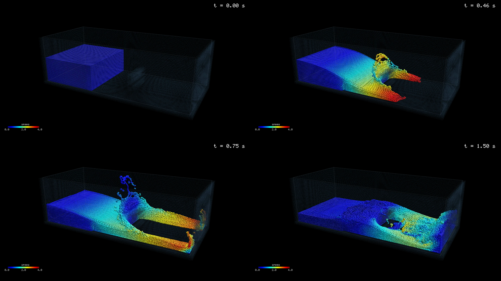

# 3D SPH dam break on CuMetal

A DualSPHysics-style dam break — 201,665 particles, weakly-compressible SPH,
solved *and* rendered by CUDA kernels, running on an Apple GPU through CuMetal.

<video src="https://github.com/Lulzx/cuda-metal/raw/main/demos/sph/media/dambreak.mp4" poster="https://github.com/Lulzx/cuda-metal/raw/main/demos/sph/media/dambreak-poster.png" controls muted loop playsinline width="100%"></video>

*1920x1080, 60 fps, 5 s of video for 1.5 s of physics. This copy is downscaled
to 720p; `run.sh` writes full-resolution `out/dambreak.mp4`. If your viewer
strips `<video>`, the same file plays
[here](https://github.com/Lulzx/cuda-metal/blob/main/demos/sph/media/dambreak.mp4).*



*t = 0.00 s (hydrostatic column at rest) — 0.46 s (front past the obstacle) —
0.75 s (splash-up, jets down both sides) — 1.50 s (reflected off the far wall,
backwash).*

Nothing here is a Metal shader. It is stock CUDA C++ — `__global__` kernels,
`<<<grid, block>>>` launches, `__shared__`, `__syncthreads()`, `atomicAdd`,
`atomicMin`, `float4` — compiled by clang's CUDA front end and executed by
`libcumetal`. The point of the demo is that a real, heavy, stateful GPU
workload (60,000 dependent kernel launches feeding each other, plus a
hand-written rasterizer) runs unmodified.

---

## Contents

- [Quick start](#quick-start)
- [Results](#results)
- [Architecture](#architecture)
- [The physics](#the-physics)
- [Numerical stability](#numerical-stability-what-actually-went-wrong)
- [The renderer](#the-renderer)
- [The scene](#the-scene)
- [Verification](#verification)
- [Performance](#performance)
- [Command-line reference](#command-line-reference)
- [What this exercises in CuMetal](#what-this-exercises-in-cumetal)
- [Known limits](#known-limits)
- [File map](#file-map)

---

## Quick start

```bash
./demos/sph/run.sh --selftest     # numerical gate against a CPU reference
./demos/sph/run.sh                # full render -> demos/sph/out/dambreak.mp4, ~7 min
```

`run.sh` compiles `main.cu` with the CuMetal CUDA toolchain, links against
`libcumetal`, and execs the binary with whatever arguments you pass it. It
auto-detects a build directory (`build-release`, `build`, `build-nosshim`,
`build-noshim`); override with `CUMETAL_BUILD_DIR`.

`ffmpeg` must be on `PATH` — frames are piped to it as raw RGB, so no
intermediate 1.9 GB of PPM ever hits the disk. `--no-video` skips it entirely.

A few useful variations:

```bash
# Fast iteration: quarter resolution, 40 frames, no encode, dump one still.
./demos/sph/run.sh --frames 40 --width 960 --height 540 --no-video --ppm out/check.ppm

# Heavier: 400k particles.
./demos/sph/run.sh --dp 0.016

# Different camera.
./demos/sph/run.sh --az -40 --el 32 --dist 4.6
```

---

## Results

Measured on an Apple M4 Pro (16-core GPU), CuMetal `build-release`:

| | |
|---|---|
| particles | 201,665 (97,812 fluid + 103,853 boundary) |
| search grid | 64 x 31 x 24 = 47,616 cells, rebuilt every step |
| timesteps | 60,000 for 1.5 s of physics (`dt = 2.5e-5 s`) |
| kernel launches | ~481,000 (8 per step + 3 per frame) |
| throughput | **6.5 ms/step**, 390 s wall for the whole run |
| output | 300 frames at 1920x1080, 60 fps |
| provenance | every launch: `device=apple_gpu`, `semantic_quality=exact` |

Final run summary:

```
particles      : 201665 (97812 fluid)
SPH steps      : 60000  (dt=2.5e-05, t_end=1.500 s)
frames rendered: 300 @ 1920x1080
wall time      : 390.45 s  (6.51 ms/step)
max fluid speed: 6.919 m/s
fluid density  : [876.6, 1080.4] kg/m^3 (rho0=1000)
final frame   : vmax=3.521 m/s, rho=[985.8, 1014.1]
PASS: SPH dam break simulated and rendered on CuMetal
```

No approximate kernels, no host fallback. Verify for yourself:

```bash
CUMETAL_TRACE_GPU=1 ./demos/sph/out/sph_dambreak --frames 1 --no-video 2>&1 \
  | grep -o 'semantic_quality=[a-z]*' | sort | uniq -c
```

---

## Architecture

Everything that touches a particle is a kernel. The host builds the scene once,
drives the loop, and stamps 2D chrome (wireframe, colourbar, timer) onto the
finished RGB frame — that part is pure 2D drawing with no GPU value.

### Per timestep — 8 launches

| # | kernel | job | notable CUDA |
|---|---|---|---|
| 1 | `k_fill_uint` | zero the cell histogram | — |
| 2 | `k_hash_count` | cell index per particle, histogram it | `atomicAdd(unsigned*)` |
| 3 | `k_scan_block` | per-block exclusive prefix sum of the histogram | `__shared__`, `__syncthreads()` |
| 4 | `k_scan_blocksums` | single-block scan of the per-block totals | `__shared__`, `__syncthreads()` |
| 5 | `k_scan_add` | add block offsets back | — |
| 6 | `k_scatter` | counting sort: reorder pos/vel/rho/type into cell order | `atomicAdd` as a bump allocator |
| 7 | `k_forces` | 27-cell neighbour sweep: continuity + delta-SPH + pressure + viscosity | 24 kernel args, `float4` |
| 8 | `k_integrate` | Euler–Cromer update, density clamp, containment | — |

Plus one `cudaMemcpyDeviceToDevice` between 5 and 6 to seed the scatter cursors
from the cell offsets.

The sort is a **full counting sort every single step**, not an incremental
update. It costs about 1% of the frame and buys perfectly coherent neighbour
reads in `k_forces`, which is 96% of the frame. Particle arrays ping-pong
between two buffers: `k_scatter` writes the sorted copy, `k_forces` and
`k_integrate` work in it, and it becomes the input for the next step.

The three-kernel scan is a shared-memory Hillis–Steele scan. `k_scan_blocksums`
runs as a single 512-thread block, which caps the grid at 512 x 512 = 262,144
cells. The host checks this and refuses to start rather than silently
corrupting the offsets (`grid too large for the single-pass scan`).

### Per frame — 3 launches

| # | kernel | job | notable CUDA |
|---|---|---|---|
| 1 | `k_clear` | reset depth to `0xFFFFFFFF`, colour to black | — |
| 2 | `k_splat_depth` | sphere-impostor splat, depth-only | `atomicMin(unsigned*)` |
| 3 | `k_splat_shade` | second pass, shades only pixels the particle won | — |

Plus `k_stats`, a small `atomicMax` reduction that pulls max speed and the
density range back for the per-frame health line and the end-of-run gates.

---

## The physics

Weakly-compressible SPH (WCSPH). Every symbol below appears verbatim in
`k_forces`.

### Kernel function

Wendland C2 in 3D, with `q = r/h` and support `q < 2`:

```
W(q)  = aD (1 - q/2)^4 (2q + 1),        aD = 21 / (16 pi h^3)
```

The gradient is only ever needed in the form `grad_i W_ij = f * (r_i - r_j)`,
so `wendland_f` returns `f` directly and no division by `r` is needed:

```
f = -5 aD (1 - q/2)^3 / h^2
```

`h = 1.3 dp` gives a support radius of `2h = 2.6 dp`, roughly 74 neighbours in
3D. The search grid uses cell size `2h`, so a 3x3x3 cell sweep is exactly
sufficient.

### Equation of state

Tait, `gamma = 7`:

```
P = B ((rho/rho0)^7 - 1),   B = c0^2 rho0 / 7,   c0 = 10 sqrt(2 g H)
```

`c0 = 32.8 m/s` for `H = 0.55 m`. The artificial sound speed is 10x the
expected flow speed, which bounds density variation to about 1% by the usual
Mach-squared argument — the run lands at 1.4% at the end, which is the right
ballpark.

`(rho/rho0)^7` is computed as four multiplies (`pow7`), not `powf`. Cheaper,
and bit-identical to the host reference so the selftest comparison stays exact.

### Governing equations

Continuity, with `v_ij = v_i - v_j`:

```
drho_i/dt = sum_j m_j (v_ij . grad_i W_ij)
```

Momentum:

```
dv_i/dt = -sum_j m_j (P_i/rho_i^2 + P_j/rho_j^2 + Pi_ij) grad_i W_ij + g
```

Monaghan artificial viscosity, applied only to approaching pairs
(`v_ij . r_ij < 0`):

```
Pi_ij = -alpha c0 mu_ij * 2/(rho_i + rho_j),
mu_ij = h (v_ij . r_ij) / (r^2 + 0.01 h^2)
```

with `alpha = 0.10`.

### delta-SPH density diffusion

The Antuono/Marrone diffusive term, added to continuity for fluid-fluid pairs
only:

```
drho_i/dt += delta h c0 sum_j 2 (rho_j - rho_i) (r_ji . grad_i W_ij)
                                / (r^2 + 0.01 h^2) * m_j/rho_j
```

with `delta = 0.10`. Note the `r_ji`, not `r_ij` — get that sign backwards and
the term is anti-diffusive, which amplifies exactly the noise it is supposed to
remove.

This is not decoration. Without it, the density field goes visibly speckled and
the run walks into an instability around `t = 0.9 s`. See below.

### Boundary conditions

DualSPHysics-style **dynamic boundary particles** (DBC): boundary particles sit
in the same neighbour search as fluid, carry a density through the same
continuity equation, and produce pressure through the same Tait EOS — but they
never move, and their density is clamped to `rho >= rho0` so their pressure is
never negative. They can push fluid away; they can never suck it in.

Three layers, spaced `dp` apart. Three is not a style choice: a fluid particle
sitting `0.5 dp` off the wall needs `2h = 2.6 dp` of boundary beneath it to see
a complete kernel. Two layers only reach `2.0 dp`, the kernel gets truncated,
the density comes out low, the pressure goes negative, and the wall starts
sucking fluid into itself. That was the first blow-up in this demo.

### Initial condition

The fluid column starts with a hydrostatic density profile rather than uniform
`rho0`:

```
rho(z) = rho0 (1 + rho0 g (H - z) / B)^(1/7)
```

Starting uniform means starting with zero pressure everywhere under a column of
water, which the solver has to fix by radiating a pressure shock through the
whole domain in the first few milliseconds. Starting hydrostatic skips that.

### Integration

Euler–Cromer (semi-implicit Euler): accelerate, then advect with the new
velocity. Density is integrated with the same step and clamped to
`[0.5, 2] rho0` purely as a numerical backstop — in a healthy run the clamp is
never touched; if it ever engages, the physics gates fail anyway.

A hard containment clamp keeps particles inside the search grid. The DBC layer
does the real fluid-wall physics; the clamp exists so a single stray particle
cannot walk out of the grid and corrupt the cell hash.

---

## Numerical stability: what actually went wrong

Worth recording, because both failures produced *plausible-looking* output for
a while before diverging, and neither was a compiler problem — the GPU matched
the CPU reference bit-for-bit throughout.

**1. Two boundary layers (fixed by using three).** Truncated kernel support at
the walls, density deficit, negative wall pressure, fluid sucked into the
boundary. Showed up as density drifting steadily away from `rho0` from about
`t = 0.03 s`.

**2. Timestep too large.** The CFL condition here is
`dt < 0.25 h / (c0 + |v|max)`, which at `h = 0.0273` and `c0 = 32.8` gives
`2.1e-4`. That bound is deceptive, because the EOS sound speed is
`c = c0 (rho/rho0)^3` — density drifting up 38% raises the local sound speed by
2.6x, which violates the CFL condition that was previously satisfied, which
drifts the density further. It is a self-reinforcing runaway with a slow fuse.

Measured behaviour:

| `dt` | outcome |
|---|---|
| `1.0e-4` | diverges by `t ~ 0.1 s`, velocity clamp saturated |
| `5.0e-5` | diverges by `t ~ 0.3 s` |
| `2.5e-5` | **stable to `t = 1.5 s`**, final density spread +/-1.4% |

`2.5e-5` is the shipped default: 200 steps per frame, 5 ms of physics per
frame, 300 frames = 1.5 s.

**3. Density noise (fixed by delta-SPH).** Even at a stable `dt`, the raw
scheme produced a speckled velocity field — visible in the render as
salt-and-pepper colour — and the whole-run density extreme reached +/-17%.
Adding `delta = 0.10` cut the peak excursion to +/-12% and the *final-frame*
spread to +/-1.4%, and the velocity field became smooth and coherent.

---

## The renderer

Splatting ~200k sphere impostors with correct occlusion, without a sort and
without 64-bit atomics.

The obvious approach — pack depth and particle index into one 64-bit key and
`atomicMin` it — needs `atomicMin` on `unsigned long long`. The 32-bit
alternative of packing depth and index into one `uint` does not fit: 200k
particles need 18 bits of index, leaving 14 bits of depth, which is nowhere
near enough.

So: **two passes over the particles.**

1. `k_splat_depth` rasterizes each particle's disc, computes the sphere-impostor
   depth per pixel (`z - nz * r` where `nz = sqrt(1 - d^2)`), quantizes it to a
   monotonic `uint` (`z * 1e6`, giving micron resolution), and `atomicMin`s it
   into the depth buffer.
2. `k_splat_shade` re-rasterizes the exact same discs, recomputes the exact same
   key, and writes colour only where `key == depth[pixel]`.

The equality test is safe because both passes execute identical arithmetic on
identical inputs, so the winning particle reproduces its key bit-for-bit. Ties
(two particles at the same quantized depth) let both write, which is harmless.
No atomics at all in the shading pass.

Everything else is per-pixel in the same loop: Lambert shading from the
impostor normal with a view-space light, a sharpened specular term, and a jet
colormap on particle speed (`--vscale`, default 4.0 m/s full scale). Boundary
particles get a fixed dim blue-grey, a much smaller radius (`0.13 dp` against
`0.55 dp` for fluid), and no shading — they are there to read as the tank, not
to compete with the water.

Frames go out as raw RGB straight into an `ffmpeg` pipe.

---

## The scene

| | |
|---|---|
| tank | 3.2 x 1.4 x 1.0 m |
| water column | 1.2 x 1.4 x 0.55 m, at the `-x` end |
| obstacle | solid block, x in [1.80, 1.95], y in [0.40, 1.00], z in [0, 0.35] |
| particle spacing `dp` | 0.021 m |
| smoothing length `h` | 0.0273 m (`1.3 dp`) |
| rest density | 1000 kg/m^3 |
| gravity | 9.81 m/s^2 |

The obstacle is what makes the video interesting: the front hits it, splits,
runs down both sides as two jets, throws a sheet vertically, and the jets
reflect off the far wall and collide on the way back.

Fluid count scales as `dp^-3`, boundary count as `dp^-2`. Measured:
`--dp 0.016` gives 400,094 particles; `--dp 0.030` gives 85,239.

---

## Verification

Two independent layers, neither of which is "it exited 0".

### 1. `--selftest` — GPU against a CPU reference

Runs in 0.16 s once compiled. Builds a small scene (877 particles) and runs 20 steps twice: once through the
complete GPU pipeline (hash, scan, counting sort, forces, integrate), once
through `ref_step`, a host brute-force O(N^2) SPH implementation living in the
same file. Because the counting sort permutes the particle arrays, the
comparison matches particles by position through a spatial hash before
comparing state.

```
selftest: 877 particles (240 fluid, 637 boundary)
selftest: matched 877/877 particles
selftest after 20 steps vs host brute-force reference:
  max |dx|      = 0.000e+00 m   (dp = 0.050 m)
  max |dv|      = 9.313e-10 m/s
  max drho/rho0 = 0.000e+00
PASS: GPU SPH matches host reference
```

Float-exact on position and density; ~1e-9 m/s on velocity, which is float
summation order — the GPU accumulates neighbours in cell order, the reference
in index order.

This is the layer that separates "the compiler is correct" from "the physics is
tuned". Every blow-up during development happened while this test was passing,
which is what told me the model was unstable rather than the code being wrong.

### 2. Physics gates on the full run

- **Front speed** within `[0.6, 3.0] x sqrt(2 g H)` — the shallow-water
  dam-break front speed. Catches both a sim that never moves and one that is
  exploding.
- **Peak density excursion** over the whole run within +/-20% of `rho0`. This
  is the single worst particle out of ~6e9 particle-steps and it peaks during
  the impact on the far wall. Deliberately loose: it is a blow-up detector, not
  a quality metric.
- **Final-frame density spread** within +/-8% of `rho0`. This is the real
  stability statement. An unstable WCSPH run cannot satisfy it, because its
  extremes keep growing instead of relaxing. The shipped run ends at +/-1.4%.

A run that diverges mid-flight aborts immediately with `FAIL` rather than
finishing and writing a plausible-looking video.

> An earlier version of this demo gated the *whole-run* extreme at +/-10% and
> failed a run that was in fact perfectly stable. The extreme was a single
> particle at a violent free-surface impact, and it stopped growing at
> `t = 0.755 s`. The gate was wrong, not the simulation. Hence the split into a
> loose blow-up bound and a tight final-frame bound.

---

## Performance

Per-kernel GPU time from `CUMETAL_TRACE_GPU=1`, averaged over 119 steps
(first launch excluded — that one pays JIT compilation):

| kernel | avg | share of step |
|---|---|---|
| `k_forces` | 4.552 ms | 96.4% |
| `k_integrate` | 0.060 ms | 1.3% |
| `k_scatter` | 0.052 ms | 1.1% |
| `k_hash_count` | 0.024 ms | 0.5% |
| `k_fill_uint` | 0.011 ms | 0.2% |
| `k_scan_block` | 0.009 ms | 0.2% |
| `k_scan_blocksums` | 0.004 ms | 0.1% |
| `k_scan_add` | 0.003 ms | 0.1% |
| `k_splat_depth` | 0.335 ms | per frame |
| `k_splat_shade` | 0.134 ms | per frame |
| `k_clear` | 0.101 ms | per frame |

Notes on reading this honestly:

- Measured near `t = 0`, when the fluid is a solid block and neighbour counts
  are at their densest. `k_forces` gets cheaper as the water spreads out.
- These durations are per-launch wall time as CuMetal reports it, so they
  include dispatch overhead. GPU time sums to ~4.7 ms/step against ~6.5 ms of
  measured wall time, so roughly 1.8 ms/step is launch and host overhead across
  8 launches plus a device-to-device copy.
- Rendering is ~0.6 ms per frame against 200 steps of physics. The picture is
  free; the fluid is the whole cost.
- The obvious optimization is staging neighbour cells into `__shared__` memory
  in `k_forces`. Not done — the demo is about running stock CUDA correctly, not
  about being the fastest possible SPH.

---

## Command-line reference

| flag | default | meaning |
|---|---|---|
| `--selftest` | off | run the GPU-vs-CPU numerical gate and exit |
| `--dp <m>` | `0.021` | particle spacing; cost scales as `dp^-3` |
| `--frames <n>` | `300` | frames to render |
| `--steps-per-frame <n>` | `200` | SPH steps between frames |
| `--dt <s>` | `2.5e-5` | timestep (see the stability table before raising it) |
| `--alpha <x>` | `0.10` | Monaghan artificial viscosity coefficient |
| `--delta <x>` | `0.10` | delta-SPH density diffusion coefficient |
| `--coefh <x>` | `1.3` | smoothing length as a multiple of `dp` |
| `--vscale <m/s>` | `4.0` | full-scale speed for the colormap |
| `--width <px>` | `1920` | frame width |
| `--height <px>` | `1080` | frame height |
| `--az <deg>` | `-62` | camera azimuth |
| `--el <deg>` | `20` | camera elevation |
| `--dist <m>` | `5.3` | camera distance from the tank centre |
| `--out <path>` | `demos/sph/out/dambreak.mp4` | encoded video path |
| `--ppm <path>` | — | also write the middle frame as a PPM still |
| `--no-video` | off | skip `ffmpeg` entirely |

Environment: `SPH_PRINT_EVERY` (default 20) controls how often the per-frame
health line is printed. `CUMETAL_TRACE_GPU=1` prints per-launch provenance.
`CUMETAL_BUILD_DIR` overrides build-directory detection in `run.sh`.

---

## What this exercises in CuMetal

Concretely, this demo depends on all of the following working:

- `__shared__` arrays with `__syncthreads()` inside a loop (the Hillis–Steele
  scan syncs twice per iteration)
- 512-thread blocks
- `atomicAdd` on `unsigned int` (histogram, and as a bump allocator whose
  *return value* determines a write address)
- `atomicMin` and `atomicMax` on `unsigned int` / `int`
- `__float_as_int` / bit-pattern float reductions
- `float4` as a kernel parameter type and in global memory
- kernels with 24 arguments mixing pointers, ints and floats
- long dependent launch chains — 60,000 steps of 8 kernels each, where every
  kernel reads what the previous one wrote
- `cudaMemcpyDeviceToDevice`
- `floorf`, `sqrtf`, `ceilf`, `fabsf`, `fminf`, `fmaxf`, `powf` in device code

It compiled and produced physically correct results on the first run. Every
problem encountered was in the SPH model, not the translation layer.

---

## Known limits

- **Single precision throughout.** Deliberate: FP64 on CuMetal goes through
  Dekker emulation (~44 bits) and would be far slower. WCSPH does not need it.
- **Fixed timestep.** No adaptive CFL control, so `dt` has to be chosen
  conservatively for the most violent moment in the run. An adaptive step would
  be faster and more robust.
- **Boundary particles are simulated, not just drawn.** They are ~52% of the
  particle count and they participate in the neighbour sweep. A dedicated
  boundary-integral method would be cheaper, but DBC is what DualSPHysics does
  and it is the honest comparison.
- **No shared-memory tiling in `k_forces`.** See the performance notes.
- **The overlay is host-side.** Wireframe, colourbar and timer are 2D drawing
  on the finished frame. They occlude rather than depth-test against the
  particles, which is why the tank edges always draw on top.
- **`k_scan_blocksums` is single-block**, capping the grid at 262,144 cells.
  The host refuses to start beyond that instead of producing wrong offsets.
- **The video is a reproduction, not a match.** The reference clip this was
  built from uses a different tank aspect, particle count and colour scale. The
  physics regime and the qualitative behaviour are the same; nothing here was
  fitted to reproduce specific frames.

---

## File map

```
demos/sph/
  main.cu     everything -- kernels, scene construction, camera, host reference
              SPH, bitmap font, overlay drawing, ffmpeg pipe
  run.sh      compile with the CuMetal toolchain, link libcumetal, exec
  media/      committed poster, stages montage, and 720p video for this README
  out/        build artifacts and full-resolution output (gitignored)
```

`main.cu` is deliberately one file. There is no build system to understand and
nothing to link but `libcumetal`.
